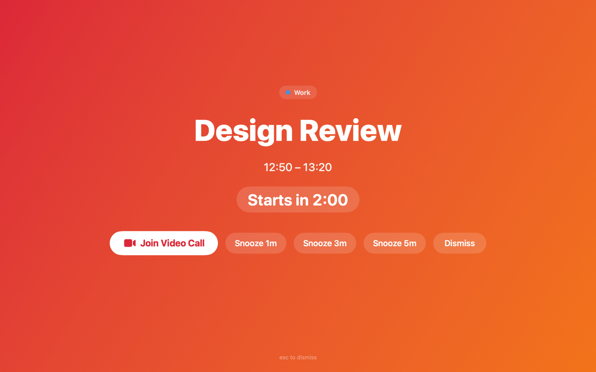
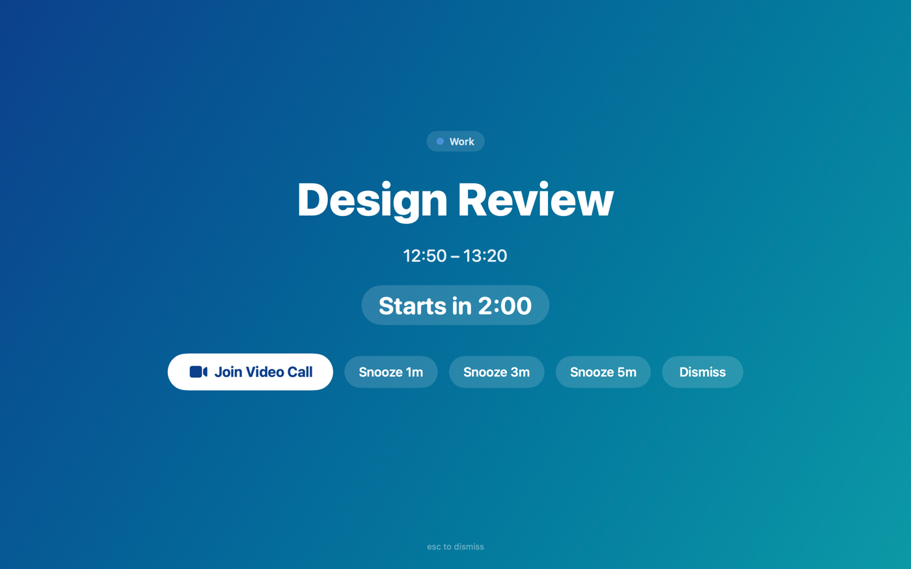

# Klaxon

**English** · [Русский](README.ru.md)

**Unmissable full-screen meeting alerts for macOS.**

Klaxon is a lightweight menu-bar app that throws a full-screen alert onto every
display right before your calendar meetings start — so you actually notice them.
When the meeting has a video link, one press takes you straight into the call.

Built for people who lose track of time: heads-down in deep work, context
switching all day, or just tired of tiny notifications that vanish before you
look up.

## Screenshots

The alert fills the screen so you can't miss it. The layout is three priority
tiers — a big **Join**, a row of numbered **Snooze** buttons, then a quiet
**Dismiss** — and every control shows its keyboard shortcut, so you can act
without reaching for the mouse (**↵** to join, **⌘1 / ⌘2 / ⌘3** to snooze,
**esc** to dismiss). A bare hero countdown (`2:00`, or `Now` once it starts)
tells you exactly how long you have. Ten built-in themes, a Random option, or
your own image:





## Features

- **Full-screen alerts** on every connected display, above other apps and
  Spaces, at a configurable lead time (at start, 1/2/5/10/15 minutes before).
- **Keyboard-first** — **↵** joins, **⌘1 / ⌘2 / ⌘3** snooze, **esc** dismisses;
  every button carries its shortcut so they're discoverable, not hidden.
- **One-click join** — detects meeting links for 30+ services (Zoom, Google
  Meet, Microsoft Teams, Webex, Whereby, Jitsi, and more) from an event's URL,
  location, or notes and shows a Join button for whichever it finds.
- **Configurable snooze** — 0–3 snooze buttons of your choosing (default 1 / 3 /
  5 minutes), plus Dismiss.
- **Themes & custom background** — ten built-in gradient themes, a **Random**
  option that picks a fresh one per alert, or use your own image as the
  background.
- **Sounds** — play any macOS system sound with the alert, or none.
- **Calendar-aware** — works with every account already set up in macOS Calendar
  (iCloud, Google, Microsoft/Exchange, …) via EventKit. Choose which calendars
  count; optionally include all-day or declined events.
- **Pause anywhere** — a global ⌃⌥P hotkey (and a menu-bar toggle) pause and
  resume alerts.
- **Menu-bar native** — no Dock icon; shows the next meeting and a live
  countdown, or just the icon if you turn on **Show icon only in menu bar**.
- **Launch at login** via `SMAppService`.
- **Robust scheduling** — wake-from-sleep and clock-change aware, with a
  pre-flight re-check so moved or cancelled meetings don't fire stale alerts.

## Settings

Open **Settings…** from the menu-bar icon (or press **⌘,**). It has two tabs:

**General**

- **Show alert** — how far ahead of each meeting the alert appears: at start
  time, or 1 / 2 / 5 / 10 / 15 minutes before.
- **Theme** — one of the ten gradients, **Random** (a different gradient each
  alert), or **Custom Image…** to use your own picture as the background.
- **Sound** — any macOS system sound, or None, with a button to preview it.
- **Snooze buttons** — add up to three (1–120 minutes each); these become the
  **⌘1 / ⌘2 / ⌘3** buttons on the alert. Remove them all to hide snooze entirely.
- **Pause all alerts** — the same switch as the global **⌃⌥P** hotkey.
- **Show icon only in menu bar** — hides the next meeting's title and countdown,
  leaving just the icon. "Paused" still shows, since that's app state you set.
- **Launch at login** — start Klaxon automatically (available when running from
  the installed app bundle).
- **Test Alert…** — preview a full-screen alert on the spot.

**Calendars**

- Pick exactly which calendars Klaxon watches — each listed with its color and
  account.
- Optionally also include **all-day events** and **events you've declined**.

## Install

Requires **macOS 14 (Sonoma) or later**.

### Download

Download the latest `Klaxon-<version>.dmg` from the
[**Releases**](https://github.com/sleonia/klaxon/releases/latest) page, open it,
and drag **Klaxon** into **Applications**.

> Klaxon is only *ad-hoc* signed — it isn't in Apple's paid Developer Program,
> so it can't be notarized. The first time you open a **downloaded** copy, macOS
> Gatekeeper blocks it ("cannot be opened because the developer cannot be
> verified"). Get past it once with **right-click → Open**, then **Open** in the
> dialog — or run
> `xattr -dr com.apple.quarantine /Applications/Klaxon.app`. It launches
> normally after that.

### Build from source

Requires the Xcode command-line tools (`xcode-select --install`). Then:

```sh
git clone https://github.com/sleonia/klaxon.git
cd klaxon
./Scripts/build-app.sh
```

That one script builds the app, signs it, and installs `Klaxon.app` into your
Applications folder. Open it, grant Calendar access when prompted, and the horn
appears in your menu bar — you're done.

> The build is signed locally, so the first time you launch it macOS may ask
> you to confirm. If it's blocked, right-click the app and choose **Open**.

> **Rebuilding often?** By default each rebuild gets a fresh ad-hoc signature,
> so macOS re-asks for Calendar access every time. Run `./Scripts/setup-signing.sh`
> **once** to create a stable local signing identity — after that, rebuilds keep
> the same signature and the permission sticks.

Run the test suite with `swift test`.

### Uninstall

```sh
./Scripts/clean.sh
```

Removes the installed app, local build artifacts, saved preferences, and
Klaxon's calendar-permission grant.

## How it works

The core is deliberately split so the interesting logic is pure and testable:

- `MeetingLinkParser` — turns an event's URL/location/notes into a join link.
- `AlertPlanner` — a pure function of `(meetings, config, snoozes, dismissed,
  now)` that decides the single next alert to fire. No clocks, no EventKit.
- `CalendarService` — the EventKit boundary (permission, fetching, change
  monitoring); everything downstream works on plain `Meeting` values.
- `MeetingScheduler` — a thin, wake-safe `DispatchSourceTimer` wrapper.
- `OverlayWindowManager` + `AlertView` — the per-screen full-screen overlay.
- `AppDelegate` — the composition root wiring the fetch → plan → arm → fire → act
  loop, recomputing from scratch on every calendar change, wake, or clock jump.

## Permissions

Klaxon needs **Full Calendar Access** to know when your meetings start. It uses
that access solely to read event times and meeting links locally — nothing
leaves your machine. It does not require Accessibility access.

## License

[MIT](LICENSE) © 2026 sleonia
